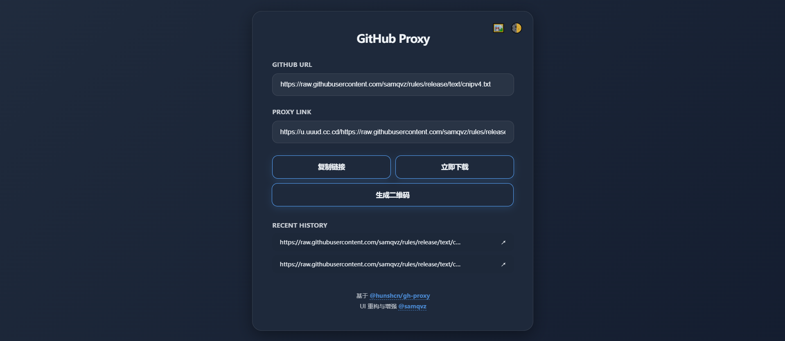
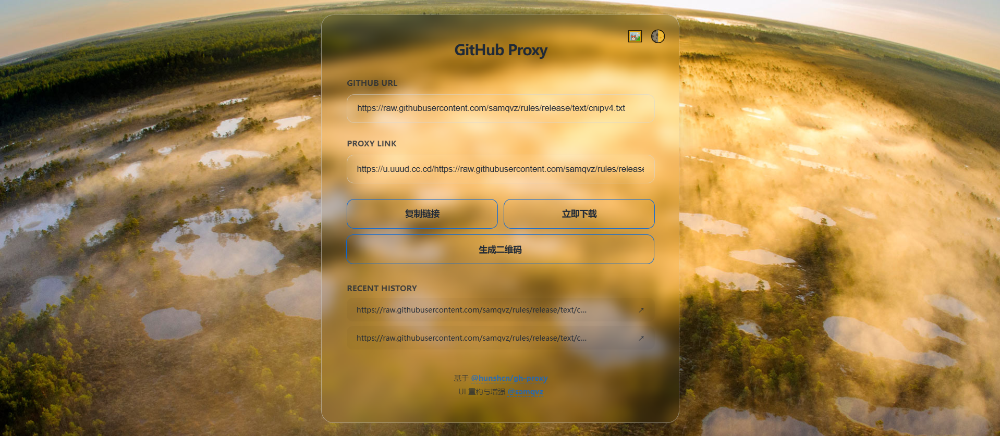

# GitHub Proxy

## 📋 简介
*   基于 [hunshcn/gh-proxy](https://github.com/hunshcn/gh-proxy) 项目。（感谢🙏）
*   仅修改Cloudflare Workers部署版本，如需 Docker、Node 等其余部署方式，请到原仓库查看。
---
*   ### [演示网站](https://u.uuud.cc.cd)

---
## 🎯 特性
* **技术重构**: 采用 ES Modules 规范，优化 Worker 冷启动速度；正则匹配优化降低运行开销。
* **界面交互**:
  * 毛玻璃UI设计，支持深浅色模式切换。
  * PC端3D卡片效果。
  * 智能解析输入链接。
  * 历史记录管理及一键二维码生成功能。
* **自定义背景**:
  * 支持上传本地图片或通过 URL/API 引入背景图片。
  * 实时面板透明度调节，配合背景图使用。本地配置自动通过 `localStorage` 记忆。
*   必应壁纸api: https://api.dujin.org/bing/1920.php
---
## ⚙️ Cloudflare Workers部署
*   打开 [Cloudflare](https://dash.cloudflare.com) ，注册，登陆。
*   `构建` > `计算和AI` > `Workers 和 Pages`，右上角 `创建应用程序` ，选 `从Hello World!开始` ，Worker name可以改成喜欢的也可以不改，点 `部署` 。
*   右上角 `编辑代码` ，把左边代码框默认代码全部删除！然后全选复制 [index.js](https://github.com/samqvz/gh-proxy/blob/master/index.js)  代码到左侧代码框，代码粘贴成功点右上角 `部署` 。
*   在 `设置` > `域和路由` 里的 `workers.dev` 即为GitHub加速地址，复制到浏览器打开。
*   可以在 `设置` 添加自定义域。（添加的自定义域必须已托管到 Cloudflare ）
---
## 📊 Cloudflare Workers计费
*   在 `Workers 和 Pages` 页面可参看使用情况。免费版每天有 10 万次免费请求，每分钟1000次请求的限制。
